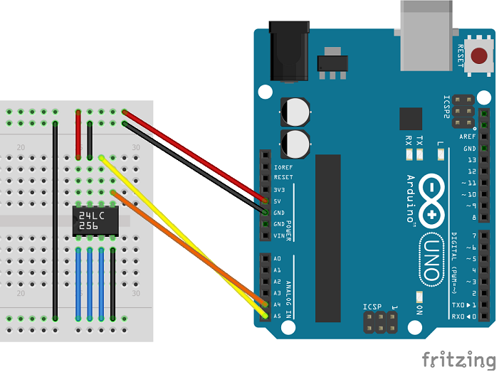

# I2C EEPROMs library for Arduino
   
 
## What is it

This library (with examples) is designed to be integrated in projects using I2C EEPROM.
It can read and write data from I2C EEPROMs.
It has been fully tested with 24LC256 device but should work with others.

## How to install

1) Download <a target="_blank" href="https://github.com/QuentinCG/Arduino-I2C-EEPROM-library/releases/download/1.0.0/I2CEEPROM_v1_0_0.zip">latest release</a>

2) On your Arduino IDE, click "Sketch" menu and then "Include Library > Add .ZIP Libraries"

3) You can now use the library for your project or launch an example ("File > Examples")

## How to connect I2C EEPROM to arduino

Most of I2C EEPROMs are connected the same way.

Here are the pin connections for 24LC256 device:

|24LC256|Arduino Source             |
|-------|-------                    |
|VCC    |5V                         |
|GND    |GND                        |
|SCL    |SCL (A5)                   |
|SDA    |SDA (A4)                   |
|Others |GND (-> I2C address = 0x50)|

## Examples

Three examples are provided with this library:

### Simple Read through all EEPROM
<a target="_blank" href="https://github.com/QuentinCG/Arduino-I2C-EEPROM-library/blob/master/examples/I2CEEPROM_Read/I2CEEPROM_Read.ino">Link to source code</a>

### Simple Write though all EEPROM
<a target="_blank" href="https://github.com/QuentinCG/Arduino-I2C-EEPROM-library/blob/master/examples/I2CEEPROM_Write/I2CEEPROM_Write.ino">Link to source code</a>

### Check consistency of the EEPROM
<a target="_blank" href="https://github.com/QuentinCG/Arduino-I2C-EEPROM-library/blob/master/examples/I2CEEPROM_FullCheck/I2CEEPROM_FullCheck.ino">Link to source code</a>

## License

This project is under MIT license. This means you can use it as you want (just don't delete the library header).

## Contribute

If you want to add more examples or improve the library, just create a pull request with proper commit message and right wrapping.
